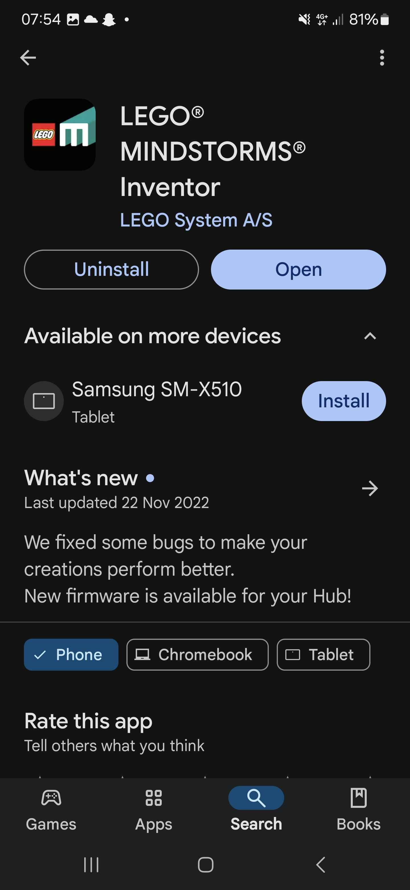

# Lego-Mindstorms-Guide
### This is a guide on how to connect to your lego mindstorm via bluetooth to your phone. 

1. Make sure you have the LEGO MINDSTORMS Inventor downloaded on your phone. You can can download it in google play store and app store. 

20240815_080435.jpg
