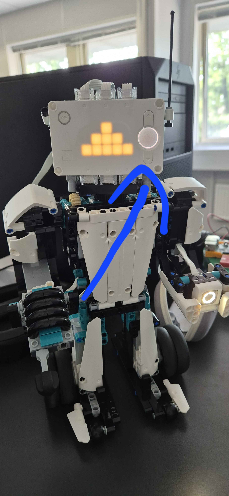
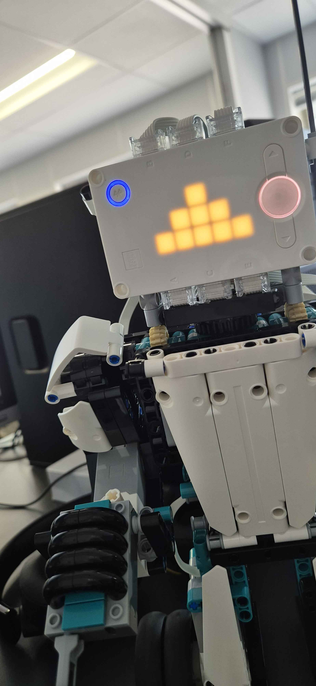
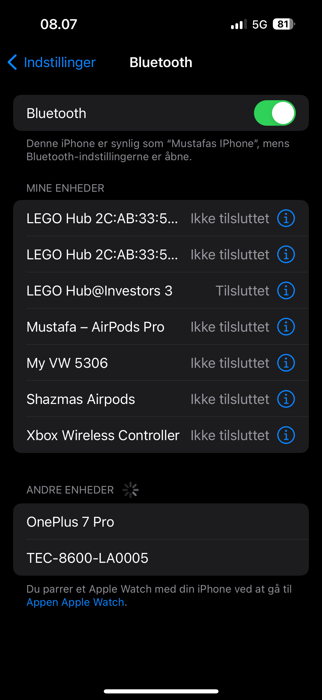

# Lego-Mindstorms-Guide
### This is a guide on how to connect to your lego mindstorm via bluetooth to your phone. 

1. Make sure you have the LEGO MINDSTORMS Inventor downloaded on your phone. You can can download it in google play store and app store. 

2. Hold the big button until it turns white. Wait a while until the Mindstorm makes noises and flashes.

3. Hold down the bluetooth button indtil it stars bepping. Once it stars bepping try adn find it on your phone under bluetooth settings. 

4. Once you have connected the mindstorm should make a sound and the bluetooth button should be shining blue. Now open the app and go through the first step by steps until and scroll right until you find blast and then press on it.

5. Now press on download all

6. Once everything is done downloading you press on the kamp activity

7. After that you press on the controller button that shows up

8. You can now press on the start button. It should be green and once you press on it the button to turn it off should also become available.
9. 
