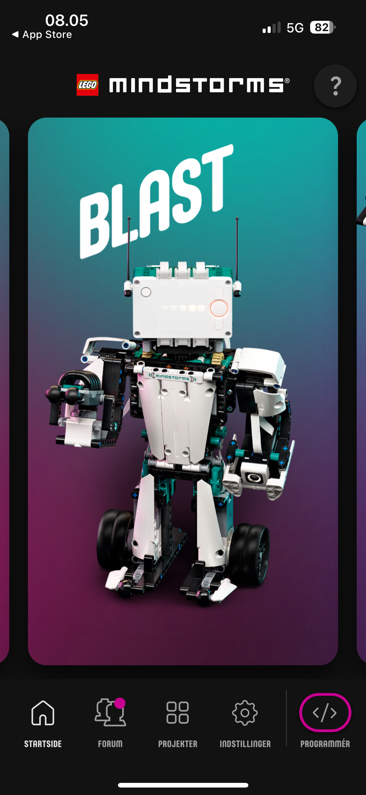
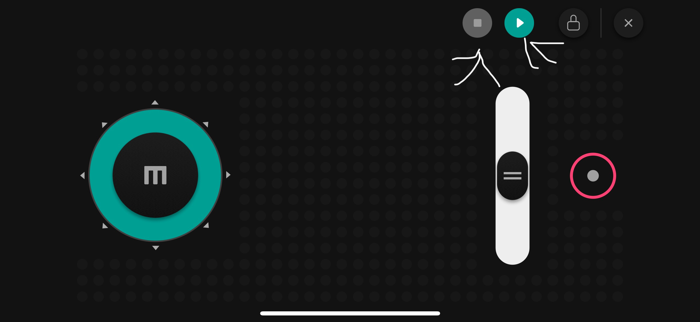

# Lego-Mindstorms-Guide
### This is a guide on how to use the lego mindstorms
1. Åbn appen og gå igennem de første trin. Rul til højre, indtil du finder Blast, og tryk derefter på det.

2. Tryk nu på "Download all".

3. Når alt er færdig med at downloade, trykker du på kamp-aktiviteten.

4. Derefter trykker du på controller-knappen, der vises.

5. Nu kan du trykke på startknappen. Den skal være grøn, og når du trykker på den, skal knappen til at slukke den også blive tilgængelig.
6. 
